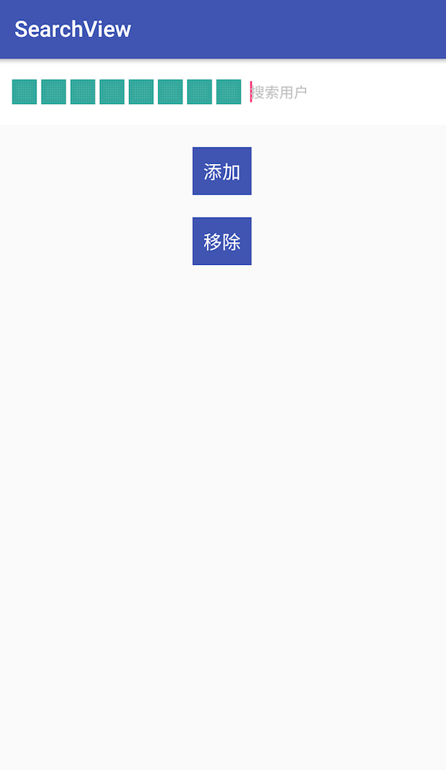

# SearchView
仿微信发起群聊，选择联系人上方搜索效果

[](http://www.apache.org/licenses/LICENSE-2.0.html)



## 使用方式
```java
    <com.yc.smoothsearchview.SmoothSearchView
        android:id="@+id/search"
        android:layout_width="match_parent"
        android:layout_height="60dp"
        android:background="#ffffff"
        android:gravity="center_vertical"
        android:orientation="horizontal"
        android:padding="10dp" />   
```
## Gradle
```
dependencies {
    implementation 'com.github.kabuqinuofu:SearchView:V1.0.0'
}
```

## LICENSE
```
Copyright 2018 kabuqinuofu

   Licensed under the Apache License, Version 2.0 (the "License");
   you may not use this file except in compliance with the License.
   You may obtain a copy of the License at

       http://www.apache.org/licenses/LICENSE-2.0

   Unless required by applicable law or agreed to in writing, software
   distributed under the License is distributed on an "AS IS" BASIS,
   WITHOUT WARRANTIES OR CONDITIONS OF ANY KIND, either express or implied.
   See the License for the specific language governing permissions and
   limitations under the License.
```
